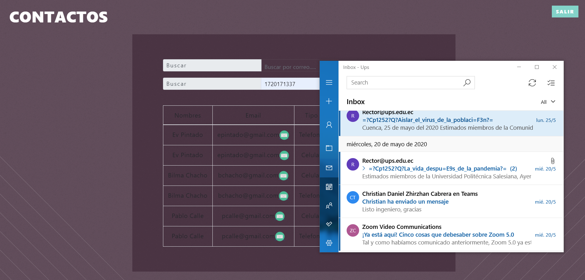

| [./media/image1.png](./media/image1.png)                                                                                                  | **FORMATO DE INFORME DE PRÁCTICA DE LABORATORIO / TALLERES / CENTROS DE SIMULACIÓN – PARA ESTUDIANTES** |                                                                                                                                                                                                 |
|-------------------------------------------------------------------------------------------------------------------------------------------|---------------------------------------------------------------------------------------------------------|-------------------------------------------------------------------------------------------------------------------------------------------------------------------------------------------------|
|                                                                                                                                           |                                                                                                         |                                                                                                                                                                                                 |
| **CARRERA**: Computación                                                                                                                  | **ASIGNATURA**: Plataformas Web                                                                         |                                                                                                                                                                                                 |
| **NRO. PRÁCTICA**:                                                                                                                        | 3                                                                                                       | **TÍTULO PRÁCTICA**: Desarrollo de una aplicación JEE basado en Servlets, JSP y JPA para el intercambio de datos en un modelo de tres capas aplicando los patrones diseño de software MVC y DAO |
| **OBJETIVO ALCANZADO:**                                                                                                                   |                                                                                                         |                                                                                                                                                                                                 |
| **ACTIVIDADES DESARROLLADAS**                                                                                                             |                                                                                                         |                                                                                                                                                                                                 |
| **Crear un repositorio en GitHub con el nombre “Práctica de laboratorio 02: Servlets, JSP y JPA”.**                                       |                                                                                                         |                                                                                                                                                                                                 |
| **Desarrollar una aplicación con tecnología JEE para gestionar una agenda telefónica en la web.**                                         |                                                                                                         |                                                                                                                                                                                                 |
| Realizar varios commits en la herramienta GitHub que demuestren el desarrollo de la aplicación.                                           |                                                                                                         |                                                                                                                                                                                                 |
| Generar el informe de la práctica con el desarrollo de cada uno de los puntos descritos anteriormente.                                    |                                                                                                         |                                                                                                                                                                                                 |
| Implementar el README del repositorio del proyecto con la misma información del informe de la práctica                                    |                                                                                                         |                                                                                                                                                                                                 |
| Subir al AVAC el informe del proyecto en formato \*.pdf. El informe debe contar con conclusiones apropiadas y la firma de cada estudiante |                                                                                                         |                                                                                                                                                                                                 |
| **CONCLUSIONES**:                                                                                                                         |                                                                                                         |                                                                                                                                                                                                 |
| **RECOMENDACIONES**:                                                                                                                      |                                                                                                         |                                                                                                                                                                                                 |

-   **Implemetar de una página web con estructura y diseño en JPA.**

-   **Utilizar el DAO y Servlets para los controladores del programa.**

-   **Trabajar con bases de datos OMDB y crear un repositorio en Github para su
    implementación.**

Link:
https://github.com/EvelynPintado23/Pr-ctica-de-laboratorio-02-Servlets-JSP-y-JPA.git

-   Implementación de JPA

-   Funcionamiento de la aplicación

-   Los usuarios anónimos pueden listar los números de teléfono de un usuario
    usando su número de cédula o correo electrónico

-   Podrá llamar o enviar un correo electrónico desde el sistema usando
    aplicaciones externas.

-   Los usuarios pueden registrarse en la aplicación a través de un formulario
    de creación de cuentas.

-   Un usuario puede iniciar sesión usando su correo y contraseña

-   Una vez iniciado sesión el usuario podrá: o Registrar, modificar, eliminar,
    buscar y listar sus teléfonos

-   Los datos siempre deberán ser validados cuando se trabaje a través de
    formularios

-   Parte Pública y Privada

-   Este trabajo nos ha demostrado la manera correcta para el uso de DAOS y JPA
    en JEE utilizando Servlets y JSP.

-   Se trabajó en diferentes formatos para ver cómo cambian los datos entre las
    aplicaciones.

-   Se conecto una aplicación externa con nuestro sistema.

-   Se recomienda usar la aplicación determinada del correo dentro de su propio
    computador. el sistema se conecte con el sistema de manera correcta, porque
    al realizar esta acción en cualquier navegador pondrían existir errores.

-   Es mucho más fácil comenzar trabajando con los DAOS al comienzo del
    desarrollo de la aplicación, luego las modelos y el JDBC para terminar con
    los controladores para los métodos y al final la interfaz como medio de
    optimización de tiempo.

**Nombre de estudiante: Evelyn Pintado Ch.**

**Firma de estudiante:**

